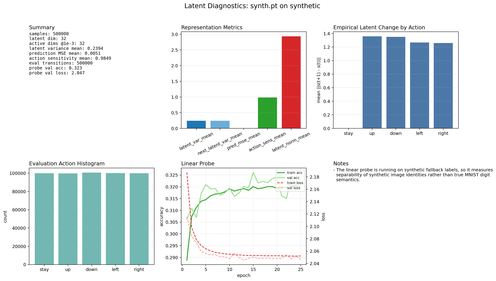
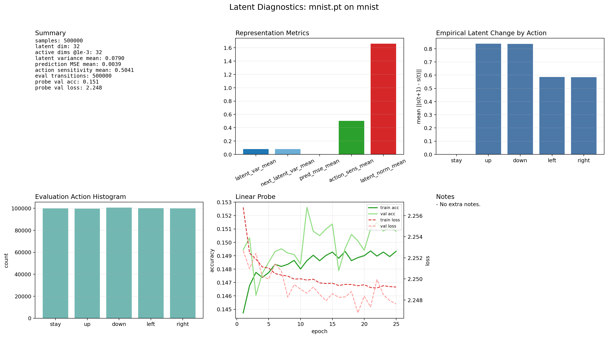
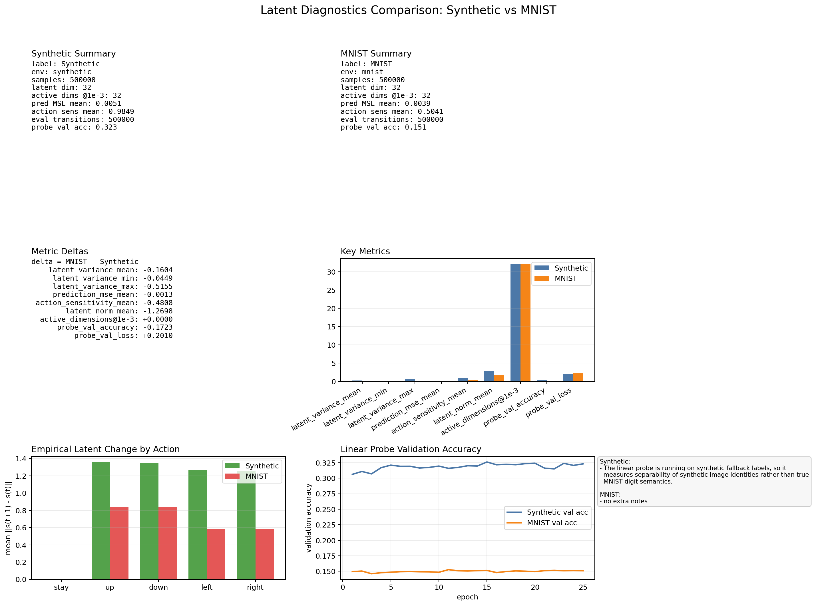

# Sensorimotor JEPA + Active Inference

This repository studies a sensorimotor reinterpretation of JEPA in which the conditioning variable is the agent action rather than a positional side signal.

The current codebase covers:

- an active-vision MNIST glimpse environment
- rollout and transition collection
- a first deterministic latent-prediction baseline
- latent diagnostics and plotting
- synthetic-vs-MNIST comparison tooling

## Core Idea

The working baseline uses:

- one encoder `q_phi(s_t | o_t)`
- one action-conditioned predictor `p_theta(s_{t+1} | s_t, a_t)`
- one latent prediction objective comparing predicted next latent to encoded next observation

The long-term target is an Active Inference style formulation with a proper latent KL. The current implementation uses a deterministic MSE proxy so the full pipeline can be exercised end to end first.

## Environment

`MNISTGlimpseEnv` exposes:

- observation: a local `glimpse_size x glimpse_size` crop
- hidden world: a `28 x 28` image
- action space:
  - `0 = stay`
  - `1 = up`
  - `2 = down`
  - `3 = left`
  - `4 = right`

The environment supports two data sources:

- real MNIST through `torchvision.datasets.MNIST`
- a synthetic fallback for offline smoke tests

## Setup

Create and populate a virtual environment:

```bash
python -m venv .venv
. .venv/bin/activate
python -m pip install -r requirements.txt
```

## Quick Smoke Tests

Run the environment only:

```bash
python scripts/test_env.py --synthetic
```

That command is random by default. For a reproducible rollout:

```bash
python scripts/test_env.py --synthetic --seed 0
```

If MNIST is not cached locally yet:

```bash
python scripts/test_env.py --download
```

This writes a rollout image to `artifacts/mnist_glimpse_rollout.png`.

## Rollout Logging

Collect transition data for later training:

```bash
python scripts/collect_rollouts.py --synthetic --episodes 8
```

Outputs:

- `artifacts/rollouts/rollouts.json`
- `artifacts/rollouts/transitions.npz`

## First Training Baseline

The first learner is intentionally small:

- one MLP encoder from glimpse to latent
- one action embedding plus MLP predictor from `(s_t, a_t)` to `s_{t+1}`
- one deterministic latent prediction loss

Small smoke test:

```bash
python scripts/train_predictor.py --synthetic --episodes 32 --steps 8 --epochs 5 --seed 0
```

This writes a checkpoint to `artifacts/checkpoints/first_baseline.pt`.

## Latent Diagnostics

Inspect the learned representation directly:

- latent variance across dimensions
- action sensitivity of the predictor
- empirical latent change by action
- frozen linear probe quality

Example:

```bash
python scripts/evaluate_latents.py --synthetic --episodes 64 --steps 8 --seed 0
```

This writes `artifacts/analysis/latent_diagnostics.json`.

Render the report as a figure:

```bash
python scripts/plot_latent_diagnostics.py
```

This writes `artifacts/analysis/latent_diagnostics.png`.

## Reproducing The Current Synthetic-vs-MNIST Comparison

The figures currently committed under `docs/figures/` were produced with the following long-run comparison protocol.

### 1. Train On Synthetic

```bash
python scripts/train_predictor.py \
  --synthetic \
  --epochs 100 \
  --episodes 5000 \
  --steps 100 \
  --seed 0 \
  --checkpoint artifacts/checkpoints/synth.pt
```

### 2. Train On Real MNIST

```bash
python scripts/train_predictor.py \
  --download \
  --epochs 100 \
  --episodes 5000 \
  --steps 100 \
  --seed 0 \
  --checkpoint artifacts/checkpoints/mnist.pt
```

### 3. Evaluate Synthetic Latents

```bash
python scripts/evaluate_latents.py \
  --synthetic \
  --episodes 5000 \
  --steps 100 \
  --seed 0 \
  --checkpoint artifacts/checkpoints/synth.pt \
  --output artifacts/analysis/synth.json
```

### 4. Evaluate MNIST Latents

```bash
python scripts/evaluate_latents.py \
  --download \
  --episodes 5000 \
  --steps 100 \
  --seed 0 \
  --checkpoint artifacts/checkpoints/mnist.pt \
  --output artifacts/analysis/mnist.json
```

### 5. Plot Per-Dataset Diagnostics

```bash
python scripts/plot_latent_diagnostics.py \
  --input artifacts/analysis/synth.json \
  --output artifacts/analysis/latent_diagnostics_synth.png

python scripts/plot_latent_diagnostics.py \
  --input artifacts/analysis/mnist.json \
  --output artifacts/analysis/latent_diagnostics_mnist.png
```

### 6. Plot The Comparison Figure

```bash
python scripts/compare_latent_diagnostics.py \
  --left artifacts/analysis/synth.json \
  --right artifacts/analysis/mnist.json \
  --left-label Synthetic \
  --right-label MNIST
```

This writes:

- `artifacts/analysis/synth.json`
- `artifacts/analysis/mnist.json`
- `artifacts/analysis/latent_diagnostics_synth.png`
- `artifacts/analysis/latent_diagnostics_mnist.png`
- `artifacts/analysis/latent_diagnostics_comparison.png`

## Current Result Snapshot

The current larger-scale comparison shows:

- no obvious collapse on MNIST: all `32/32` latent dimensions remain active
- substantially lower latent variance on MNIST than on synthetic
- substantially lower action sensitivity on MNIST than on synthetic
- slightly lower latent prediction MSE on MNIST, which by itself is not evidence of a better representation
- a much weaker linear probe on MNIST than on synthetic

In short: the MNIST representation is alive, but flatter and less action-sensitive than the synthetic one.

### Synthetic Diagnostics



### MNIST Diagnostics



### Synthetic vs MNIST Comparison



## Notes On Interpretation

- The synthetic probe is not a true digit-semantics benchmark. It is measured on synthetic fallback labels.
- The MNIST probe is the more meaningful downstream signal.
- Lower latent prediction error does not automatically mean a better representation if the latent also becomes flatter or less action-sensitive.

## Repository Layout

```text
sensorimotor-jepa-aif/
├── README.md
├── docs/
│   └── figures/
├── requirements.txt
├── scripts/
│   ├── collect_rollouts.py
│   ├── compare_latent_diagnostics.py
│   ├── evaluate_latents.py
│   ├── plot_latent_diagnostics.py
│   ├── test_env.py
│   └── train_predictor.py
└── src/
    └── sm_jepa_aif/
        ├── analysis/
        ├── data/
        ├── envs/
        ├── losses/
        ├── models/
        ├── policies/
        └── train.py
```
